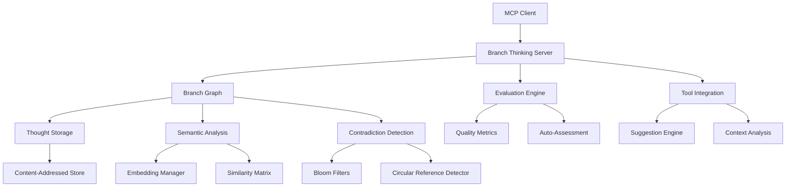

# Branch Thinking MCP Server

[](https://github.com/quanticsoul4772/branch-thinking/actions/workflows/ci.yml)
[](https://codecov.io/gh/quanticsoul4772/branch-thinking)
[](https://badge.fury.io/js/branch-thinking-mcp)
[](https://opensource.org/licenses/MIT)
[](https://hub.docker.com)

An MCP server for multi-path reasoning with semantic analysis, contradiction detection, and persistence capabilities.

## Quick Start

```bash
# Install globally
npm install -g branch-thinking-mcp

# Run demo
npx branch-thinking-mcp demo

# Or use with Docker
docker run -d branch-thinking-mcp
```

## Features

- **Multi-Branch Reasoning**: Explore multiple solution paths simultaneously
- **Semantic Analysis**: 384-dimensional embeddings using Xenova/all-MiniLM-L6-v2
- **Contradiction Detection**: Bloom filters for O(1) contradiction checking
- **Circular Reasoning Detection**: Identifies logical loops and dependencies
- **Persistence**: Export/import reasoning sessions for long-term storage
- **Auto-Evaluation**: Real-time quality assessment with feedback
- **Tool Integration**: Suggests relevant MCP tools based on context

## Architecture



### Core Components

- **Content-Addressed Storage**: SHA256 hashing prevents duplicate thoughts
- **Graph-Based Structure**: O(1) navigation between branches and thoughts
- **Event Sourcing**: Incremental updates without full recalculation
- **Differential Evaluation**: Only processes changes since last evaluation

### Performance Metrics

- **Comparisons**: 40x reduction (40,000 to 1,000 for 200 thoughts)
- **Evaluation Speed**: 10x faster (500ms → 50ms)
- **Memory Efficiency**: 3x improvement through deduplication
- **Response Time**: <50ms for semantic navigation
- **Model Loading**: ~1-2 seconds on first use (lazy loaded)

## Installation

```bash
npm install -g branch-thinking-mcp
```

### Development Setup

```bash
# Clone repository
git clone https://github.com/quanticsoul4772/branch-thinking.git
cd branch-thinking

# Install dependencies
npm install

# Run tests
npm test

# Start development server
npm run dev
```

### Docker Setup

```bash
# Build image
docker build -t branch-thinking-mcp .

# Run with docker-compose
docker-compose up -d

# Health check
docker-compose ps
```

## Commands

### Basic Operations

```javascript
// Add a thought
{"content": "Breaking down authentication system", "type": "analysis", "keyPoints": ["security", "scalability"]}

// Create a branch
{"content": "OAuth2 implementation", "type": "solution", "parentBranchId": "main"}

// Add cross-reference
{"content": "Comparing approaches", "crossRefs": [
  {"toBranch": "oauth", "type": "builds_upon", "reason": "Extends OAuth solution", "strength": 0.9}
]}
```

### Navigation Commands

```javascript
{"command": {"type": "list"}}                    // List all branches
{"command": {"type": "focus", "branchId": "id"}} // Switch to branch
{"command": {"type": "history", "branchId": "id"}} // Show branch history
```

### Analysis Commands

```javascript
{"command": {"type": "setGoal", "goal": "Optimize database queries"}}
{"command": {"type": "evaluate"}}                // Evaluate current branch
{"command": {"type": "statistics"}}              // Get reasoning metrics
{"command": {"type": "findContradictions"}}      // Detect conflicts
{"command": {"type": "detectCircular"}}          // Find circular reasoning
{"command": {"type": "prune", "data": {"threshold": 0.4}}} // Remove weak branches
```

### Semantic Navigation

```javascript
{"command": {"type": "findSimilar", "query": "caching strategies"}}
{"command": {"type": "jumpToRelated", "data": {"thoughtId": "abc123", "limit": 5}}}
{"command": {"type": "semanticPath", "data": {"fromThoughtId": "abc123", "toThoughtId": "def456"}}}
```

### Configuration

```javascript
{"command": {"type": "toggleAutoEval"}}          // Toggle auto-evaluation
{"command": {"type": "configAutoEval", "data": {
  "thresholds": {"excellent": 0.85, "good": 0.65},
  "suggestPivotThreshold": 0.4
}}}
```

### Persistence

```javascript
{"command": {"type": "export"}}                  // Export session
{"command": {"type": "import", "data": {...}}}  // Import session
```

## Data Structures

### Branch States
- `active`: Currently being explored
- `suspended`: Temporarily paused
- `completed`: Reached conclusion
- `dead_end`: Abandoned (auto-set when score < 0.3)

### Cross-Reference Types
- `builds_upon`: Extends another branch
- `contradictory`: Opposes another branch
- `complementary`: Supports from different angle
- `alternative`: Different approach

### Thought Types
- `analysis`: Breaking down problems
- `hypothesis`: Proposing solutions
- `validation`: Testing assumptions
- `synthesis`: Combining insights
- `observation`: Noting patterns

## Evaluation Metrics

Each branch is evaluated on:
- **Coherence** (0-1): Logical flow and consistency
- **Contradiction** (0-1): Internal conflicts (lower is better)
- **Information Gain** (0-1): New insights vs repetition
- **Goal Alignment** (0-1): Progress toward objectives
- **Redundancy** (0-1): Repetitive content (lower is better)

### Quality Ratings
- **Excellent** (>0.8): High-quality reasoning
- **Good** (>0.6): Solid with room for improvement
- **Moderate** (>0.4): Issues identified
- **Poor** (≤0.4): Significant problems

## Technical Implementation

### Bloom Filter Configuration
- Positive assertions: 5000 elements, 0.001 FPR
- Negative assertions: 5000 elements, 0.001 FPR
- Concept pairs: 10000 elements, 0.01 FPR

### Sparse Matrix Storage
- Threshold: 0.3 similarity
- Memory savings: 90%+
- Enables clustering algorithms

### Semantic Embeddings
- Model: Xenova/all-MiniLM-L6-v2
- Dimensions: 384
- Accuracy: ~85% correlation with human judgment

## Error Handling

### JSON-RPC Protocol
The server ensures clean MCP protocol communication by:
1. Suppressing stdout output before imports
2. Setting environment variables for library silence
3. Filtering stdout to only allow JSON-RPC messages

See [TROUBLESHOOTING.md](TROUBLESHOOTING.md) for common issues.

## Troubleshooting

| Issue | Solution |
|-------|----------|
| `ENOENT: no such file or directory` | Run `npm run build` first |
| `Permission denied` on Docker | Check Docker daemon is running |
| High memory usage | Reduce embedding cache size in config |
| Slow semantic analysis | Increase similarity threshold |
| Type errors during build | Run `npm run typecheck` for details |

## Contributing

1. Fork the repository
2. Create a feature branch: `git checkout -b feature/amazing-feature`
3. Run tests: `npm test`
4. Commit changes: `git commit -m 'feat: add amazing feature'`
5. Push to branch: `git push origin feature/amazing-feature`
6. Open a Pull Request

## Roadmap

- [ ] GraphQL API endpoint
- [ ] Web UI for visualization
- [ ] Integration with popular IDEs  
- [ ] Advanced reasoning patterns
- [ ] Multi-language support

## API Reference

### OpenAPI Specification

The complete API specification is available in machine-readable format:

- **OpenAPI 3.1 Specification**: [`/spec/openapi.yaml`](spec/openapi.yaml)
- **JSON Endpoint**: `http://localhost:3001/openapi.json` (when running the OpenAPI server)

```bash
# Start the OpenAPI documentation server
npm run openapi:serve

# Access the specification
curl http://localhost:3001/openapi.json

# Validate the specification
npm run openapi:validate
```

### Tool Definition
```typescript
{
  name: "branch-thinking",
  description: "Multi-path reasoning tool",
  inputSchema: {
    type: "object",
    oneOf: [
      // Thought input schema
      // Command input schema
    ]
  }
}
```

### Response Format
```typescript
{
  thoughtId: string,
  branchId: string,
  branchState: BranchState,
  branchPriority: number,
  numThoughts: number,
  activeBranch: string,
  evaluation?: {
    score: number,
    quality: string,
    issues: string[],
    suggestions: string[]
  }
}
```

The OpenAPI specification includes comprehensive schemas for all input parameters, response formats, and command structures. It's automatically validated in CI to ensure consistency with the implementation.

## Documentation

- [CHANGELOG.md](CHANGELOG.md) - Version history
- [DEVELOPMENT.md](DEVELOPMENT.md) - Architecture and development guide
- [TROUBLESHOOTING.md](TROUBLESHOOTING.md) - Common issues and solutions

## License

MIT